# Database Schema Reference

Aminy uses **Supabase Postgres** with Row Level Security (RLS) enabled on all tables. The schema is managed through numbered SQL migrations in `supabase/migrations/`.

---

## Table of Contents

1. [Entity Relationship Diagram](#entity-relationship-diagram)
2. [Core Tables](#core-tables)
3. [Telehealth Tables](#telehealth-tables)
4. [Billing & Subscription Tables](#billing--subscription-tables)
5. [Clinical & Behavioral Tables](#clinical--behavioral-tables)
6. [Community & Engagement Tables](#community--engagement-tables)
7. [Referral & Insurance Tables](#referral--insurance-tables)
8. [System Tables](#system-tables)
9. [RLS Policy Patterns](#rls-policy-patterns)
10. [Migration History](#migration-history)

---

## Entity Relationship Diagram

```mermaid
erDiagram
    auth_users ||--|| profiles : "1:1 auto-created"
    profiles ||--o{ children : "parent has children"
    profiles ||--o{ child_profiles : "parent manages"
    profiles ||--o{ conversations : "user starts"
    conversations ||--o{ messages : "contains"
    profiles ||--o{ usage_tracking : "daily usage"
    profiles ||--|| stripe_customers : "billing link"

    providers ||--o{ provider_availability : "has schedule"
    providers ||--o{ provider_time_off : "has time off"
    providers ||--o{ appointments : "sees patients"
    profiles ||--o{ appointments : "books as patient"
    appointments ||--o| payments : "has payment"
    appointments ||--o| visit_summaries : "has summary"

    profiles ||--o{ telehealth_sessions : "participates"
    providers ||--o{ telehealth_sessions : "conducts"

    profiles ||--o{ marketplace_bookings : "books services"

    children ||--o{ medications : "takes"
    medications ||--o{ medication_logs : "administration logs"
    children ||--o{ behavior_intervention_plans : "has BIPs"
    children ||--o{ assessment_results : "has assessments"
    children ||--o{ crisis_logs : "crisis events"
    children ||--o{ goals : "has goals"

    profiles ||--o{ referral_codes : "owns codes"
    referral_codes ||--o{ referrals : "generates"
    referral_codes ||--o{ referral_clicks : "tracks clicks"

    profiles ||--o{ insurance_verifications : "requests"
    profiles ||--o{ insurance_documents : "uploads"

    profiles ||--o{ jr_sessions : "junior mode sessions"
    profiles ||--o{ gad7_responses : "anxiety screenings"
    profiles ||--o{ phq9_responses : "depression screenings"
```



---

## Core Tables

### `profiles`

**Migration**: 002 | **Purpose**: User profile extending Supabase `auth.users`

| Column | Type | Default | Description |
|--------|------|---------|-------------|
| `id` | uuid | PK, FK `auth.users` | User ID (matches auth) |
| `email` | text | | User email |
| `full_name` | text | | Display name |
| `avatar_url` | text | | Profile avatar URL |
| `tier` | text | `'free'` | Subscription tier |
| `role` | text | `'parent'` | User role: parent, provider, admin |
| `referred_by_code` | text | | Referral code used at signup |
| `referred_by_user_id` | uuid | | Referrer's user ID |
| `referral_credits` | integer | `0` | Earned referral credits |
| `created_at` | timestamptz | `now()` | |
| `updated_at` | timestamptz | `now()` | |

**CHECK constraint**: `tier IN ('free', 'starter', 'basic', 'core', 'pro', 'proplus')`

**Trigger**: `on_auth_user_created` fires `handle_new_user()` to auto-create a profile row when a user signs up.

**RLS**:
- Users can read/update their own profile
- Service role can update any profile (for webhook-driven tier changes)

---

### `children`

**Migration**: 014 | **Purpose**: Child records linked to a parent

| Column | Type | Default | Description |
|--------|------|---------|-------------|
| `id` | uuid | PK, `gen_random_uuid()` | |
| `user_id` | uuid | FK `profiles.id` | Parent's user ID |
| `name` | text | NOT NULL | Child's first name |
| `date_of_birth` | date | | |
| `diagnoses` | text[] | | Array of diagnosis labels |
| `communication_level` | text | | verbal, limited-verbal, non-verbal |
| `priorities` | text[] | | Current focus areas |
| `created_at` | timestamptz | `now()` | |
| `updated_at` | timestamptz | `now()` | |

**RLS**: Parents can CRUD their own children. Providers with approved access can read.

---

### `child_profiles`

**Migration**: 014 | **Purpose**: Extended child profile data (sensory preferences, triggers, strategies)

| Column | Type | Default | Description |
|--------|------|---------|-------------|
| `id` | uuid | PK | |
| `child_id` | uuid | FK `children.id` | |
| `user_id` | uuid | FK `profiles.id` | Parent |
| `sensory_preferences` | jsonb | | Sensory profile data |
| `triggers` | jsonb | | Known triggers |
| `calming_strategies` | jsonb | | Effective strategies |
| `daily_routine` | jsonb | | Typical daily schedule |
| `created_at` | timestamptz | `now()` | |
| `updated_at` | timestamptz | `now()` | |

---

### `conversations`

**Migration**: 002 | **Purpose**: AI conversation threads

| Column | Type | Default | Description |
|--------|------|---------|-------------|
| `id` | uuid | PK | |
| `user_id` | uuid | FK `auth.users` | |
| `title` | text | | Auto-generated title |
| `module_context` | text | | Which screen the conversation started on |
| `created_at` | timestamptz | `now()` | |
| `updated_at` | timestamptz | `now()` | |

### `messages`

**Migration**: 002 | **Purpose**: Individual messages within conversations

| Column | Type | Default | Description |
|--------|------|---------|-------------|
| `id` | uuid | PK | |
| `conversation_id` | uuid | FK `conversations.id` | |
| `role` | text | | `user`, `assistant`, or `system` |
| `content` | text | | Message content |
| `tokens_used` | integer | | Token count |
| `created_at` | timestamptz | `now()` | |

---

## Telehealth Tables

### `providers`

**Migration**: 001 | **Purpose**: Healthcare provider profiles

| Column | Type | Default | Description |
|--------|------|---------|-------------|
| `id` | uuid | PK | |
| `user_id` | uuid | FK `auth.users` | |
| `name` | text | NOT NULL | |
| `title` | text | | e.g., "BCBA, LBA" |
| `specialty` | text | | e.g., "ABA Therapy" |
| `bio` | text | | |
| `avatar_url` | text | | |
| `hourly_rate` | decimal(10,2) | | Session rate |
| `accepted_insurance` | text[] | | List of accepted payers |
| `license_number` | text | | |
| `license_state` | text | | |
| `npi` | text | | National Provider Identifier |
| `is_active` | boolean | `true` | |
| `rating` | decimal(3,2) | | Average rating |
| `total_reviews` | integer | `0` | |
| `created_at` | timestamptz | `now()` | |
| `updated_at` | timestamptz | `now()` | |

### `provider_availability`

**Migration**: 001 | **Purpose**: Weekly recurring availability slots

| Column | Type | Default | Description |
|--------|------|---------|-------------|
| `id` | uuid | PK | |
| `provider_id` | uuid | FK `providers.id` | |
| `day_of_week` | integer | | 0 (Sun) - 6 (Sat) |
| `start_time` | time | | Slot start |
| `end_time` | time | | Slot end |
| `is_available` | boolean | `true` | |

### `provider_time_off`

**Migration**: 001 | **Purpose**: Provider vacation / blocked dates

| Column | Type | Default | Description |
|--------|------|---------|-------------|
| `id` | uuid | PK | |
| `provider_id` | uuid | FK `providers.id` | |
| `start_date` | date | | |
| `end_date` | date | | |
| `reason` | text | | |

### `appointments`

**Migration**: 001 | **Purpose**: Scheduled telehealth appointments

| Column | Type | Default | Description |
|--------|------|---------|-------------|
| `id` | uuid | PK | |
| `provider_id` | uuid | FK `providers.id` | |
| `patient_id` | uuid | FK `auth.users` | |
| `scheduled_at` | timestamptz | NOT NULL | |
| `duration` | integer | `60` | Minutes |
| `status` | text | `'pending'` | pending, confirmed, completed, cancelled, no_show |
| `type` | text | | initial-assessment, follow-up, etc. |
| `notes` | text | | |
| `video_room_name` | text | | Daily.co room name |
| `video_room_url` | text | | Join URL |
| `created_at` | timestamptz | `now()` | |
| `updated_at` | timestamptz | `now()` | |

**RLS**: Patients see their own appointments. Providers see appointments where they are the provider.

### `payments`

**Migration**: 001 | **Purpose**: Telehealth appointment payments

| Column | Type | Default | Description |
|--------|------|---------|-------------|
| `id` | uuid | PK | |
| `appointment_id` | uuid | FK `appointments.id` | |
| `patient_id` | uuid | FK `auth.users` | |
| `provider_id` | uuid | FK `providers.id` | |
| `amount` | decimal(10,2) | | |
| `currency` | text | `'usd'` | |
| `status` | text | | pending, completed, refunded, failed |
| `stripe_payment_intent_id` | text | | |
| `created_at` | timestamptz | `now()` | |

### `visit_summaries`

**Migration**: 001 | **Purpose**: Post-appointment clinical summaries

| Column | Type | Default | Description |
|--------|------|---------|-------------|
| `id` | uuid | PK | |
| `appointment_id` | uuid | FK `appointments.id` | |
| `provider_id` | uuid | FK `providers.id` | |
| `summary` | text | | Session summary |
| `recommendations` | text | | |
| `next_steps` | text | | |
| `created_at` | timestamptz | `now()` | |

### `slot_holds`

**Migration**: 001 | **Purpose**: Temporary slot reservations during booking

| Column | Type | Default | Description |
|--------|------|---------|-------------|
| `id` | uuid | PK | |
| `provider_id` | uuid | FK `providers.id` | |
| `user_id` | uuid | FK `auth.users` | |
| `scheduled_at` | timestamptz | | |
| `expires_at` | timestamptz | | Auto-expires after 10 min |
| `created_at` | timestamptz | `now()` | |

**Cleanup function**: `cleanup_expired_slot_holds()` removes expired holds.

### `waitlist`

**Migration**: 001 | **Purpose**: Provider waitlist for full schedules

| Column | Type | Default | Description |
|--------|------|---------|-------------|
| `id` | uuid | PK | |
| `provider_id` | uuid | FK `providers.id` | |
| `patient_id` | uuid | FK `auth.users` | |
| `preferred_times` | jsonb | | |
| `status` | text | `'waiting'` | waiting, notified, booked, cancelled |
| `created_at` | timestamptz | `now()` | |

---

## Billing & Subscription Tables

### `stripe_customers`

**Migration**: 002 | **Purpose**: Maps Supabase users to Stripe customer IDs

| Column | Type | Default | Description |
|--------|------|---------|-------------|
| `id` | uuid | PK | |
| `user_id` | uuid | FK `auth.users`, UNIQUE | |
| `stripe_customer_id` | text | NOT NULL | Stripe customer ID (`cus_...`) |
| `created_at` | timestamptz | `now()` | |

**RLS**: Users can read their own record. Service role can insert/update (for webhook operations).

### `usage_tracking`

**Migration**: 002 | **Purpose**: Daily AI message usage counters per user

| Column | Type | Default | Description |
|--------|------|---------|-------------|
| `id` | uuid | PK | |
| `user_id` | uuid | FK `auth.users` | |
| `date` | date | `CURRENT_DATE` | |
| `message_count` | integer | `0` | Messages used today |
| `token_count` | integer | `0` | Total tokens consumed |
| `estimated_cost` | decimal(10,6) | `0` | Estimated cost in USD |
| `created_at` | timestamptz | `now()` | |

**UNIQUE constraint**: `(user_id, date)` -- one row per user per day.

---

## Clinical & Behavioral Tables

### `medications`

**Migration**: 014 | **Purpose**: Child medication records

| Column | Type | Default | Description |
|--------|------|---------|-------------|
| `id` | uuid | PK | |
| `child_id` | uuid | FK `children.id` | |
| `user_id` | uuid | FK `profiles.id` | Parent |
| `name` | text | NOT NULL | Medication name |
| `dosage` | text | | |
| `frequency` | text | | e.g., "twice daily" |
| `prescriber` | text | | Prescribing doctor |
| `start_date` | date | | |
| `end_date` | date | | |
| `notes` | text | | |
| `is_active` | boolean | `true` | |
| `created_at` | timestamptz | `now()` | |

### `medication_logs`

**Migration**: 014 | **Purpose**: Medication administration tracking

| Column | Type | Default | Description |
|--------|------|---------|-------------|
| `id` | uuid | PK | |
| `medication_id` | uuid | FK `medications.id` | |
| `user_id` | uuid | FK `profiles.id` | Who logged it |
| `administered_at` | timestamptz | | |
| `status` | text | | given, skipped, refused |
| `notes` | text | | |
| `created_at` | timestamptz | `now()` | |

### `behavior_intervention_plans`

**Migration**: 014 | **Purpose**: BIP documents for children

| Column | Type | Default | Description |
|--------|------|---------|-------------|
| `id` | uuid | PK | |
| `child_id` | uuid | FK `children.id` | |
| `user_id` | uuid | FK `profiles.id` | |
| `title` | text | | |
| `target_behavior` | text | | |
| `replacement_behavior` | text | | |
| `antecedent_strategies` | jsonb | | |
| `consequence_strategies` | jsonb | | |
| `data_collection_method` | text | | |
| `created_by_provider_id` | uuid | | Provider who created the BIP |
| `status` | text | `'active'` | |
| `created_at` | timestamptz | `now()` | |
| `updated_at` | timestamptz | `now()` | |

### `assessment_results`

**Migration**: 014 | **Purpose**: Clinical assessment scores

| Column | Type | Default | Description |
|--------|------|---------|-------------|
| `id` | uuid | PK | |
| `child_id` | uuid | FK `children.id` | |
| `user_id` | uuid | FK `profiles.id` | |
| `assessment_type` | text | | e.g., "VB-MAPP", "ABLLS-R" |
| `scores` | jsonb | | Assessment scores |
| `administered_by` | text | | |
| `administered_at` | date | | |
| `notes` | text | | |
| `created_at` | timestamptz | `now()` | |

### `crisis_logs`

**Migration**: 014 | **Purpose**: Crisis event documentation

| Column | Type | Default | Description |
|--------|------|---------|-------------|
| `id` | uuid | PK | |
| `child_id` | uuid | FK `children.id` | |
| `user_id` | uuid | FK `profiles.id` | |
| `severity` | integer | | 1-5 scale |
| `description` | text | | |
| `triggers` | text[] | | |
| `interventions_used` | text[] | | |
| `outcome` | text | | |
| `duration_minutes` | integer | | |
| `occurred_at` | timestamptz | | |
| `created_at` | timestamptz | `now()` | |

### `goals`

**Migration**: 014 | **Purpose**: Child goals and milestones

| Column | Type | Default | Description |
|--------|------|---------|-------------|
| `id` | uuid | PK | |
| `child_id` | uuid | FK `children.id` | |
| `user_id` | uuid | FK `profiles.id` | |
| `title` | text | | |
| `description` | text | | |
| `category` | text | | behavior, communication, social, academic |
| `target_date` | date | | |
| `status` | text | `'in_progress'` | in_progress, achieved, on_hold |
| `progress_percentage` | integer | `0` | |
| `created_at` | timestamptz | `now()` | |
| `updated_at` | timestamptz | `now()` | |

### `gad7_responses` / `phq9_responses`

**Migration**: 014 | **Purpose**: Standardized mental health screening scores

| Column | Type | Default | Description |
|--------|------|---------|-------------|
| `id` | uuid | PK | |
| `user_id` | uuid | FK `profiles.id` | |
| `scores` | jsonb | | Individual question scores |
| `total_score` | integer | | Computed total |
| `severity` | text | | Derived severity label |
| `administered_at` | timestamptz | `now()` | |
| `created_at` | timestamptz | `now()` | |

---

## Community & Engagement Tables

### `moderation_queue`

**Migration**: 014 | **Purpose**: Content moderation review queue

| Column | Type | Default | Description |
|--------|------|---------|-------------|
| `id` | uuid | PK | |
| `content_type` | text | | post, comment, message |
| `content_id` | uuid | | Reference to the content |
| `user_id` | uuid | FK `profiles.id` | Content author |
| `content_text` | text | | The flagged content |
| `reason` | text | | Why it was flagged |
| `status` | text | `'pending'` | pending, approved, rejected |
| `reviewed_by` | uuid | | Admin who reviewed |
| `reviewed_at` | timestamptz | | |
| `created_at` | timestamptz | `now()` | |

### `nps_responses`

**Migration**: 014 | **Purpose**: Net Promoter Score survey responses

| Column | Type | Default | Description |
|--------|------|---------|-------------|
| `id` | uuid | PK | |
| `user_id` | uuid | FK `profiles.id` | |
| `score` | integer | | 0-10 NPS score |
| `feedback` | text | | Open-ended feedback |
| `created_at` | timestamptz | `now()` | |

### `message_feedback`

**Migration**: 014 | **Purpose**: Thumbs up/down feedback on AI messages

| Column | Type | Default | Description |
|--------|------|---------|-------------|
| `id` | uuid | PK | |
| `message_id` | uuid | FK `messages.id` | |
| `user_id` | uuid | FK `profiles.id` | |
| `rating` | text | | positive, negative |
| `comment` | text | | Optional feedback text |
| `created_at` | timestamptz | `now()` | |

### `upgrade_prompt_analytics`

**Migration**: 014 | **Purpose**: Tracks when upgrade prompts are shown and conversion

| Column | Type | Default | Description |
|--------|------|---------|-------------|
| `id` | uuid | PK | |
| `user_id` | uuid | FK `profiles.id` | |
| `feature_requested` | text | | Feature that triggered the prompt |
| `current_tier` | text | | |
| `suggested_tier` | text | | |
| `action` | text | | shown, dismissed, clicked |
| `created_at` | timestamptz | `now()` | |

### `jr_sessions`

**Migration**: 014 | **Purpose**: Junior Mode interactive session data

| Column | Type | Default | Description |
|--------|------|---------|-------------|
| `id` | uuid | PK | |
| `user_id` | uuid | FK `profiles.id` | Parent |
| `child_id` | uuid | FK `children.id` | |
| `session_type` | text | | calm_tool, story, game |
| `duration_seconds` | integer | | |
| `data` | jsonb | | Session-specific data |
| `created_at` | timestamptz | `now()` | |

---

## Referral & Insurance Tables

### `referral_codes`

**Migration**: 009 | **Purpose**: Unique referral codes per user

| Column | Type | Default | Description |
|--------|------|---------|-------------|
| `id` | uuid | PK | |
| `user_id` | uuid | FK `profiles.id` | Code owner |
| `code` | text | UNIQUE | Auto-generated via `generate_referral_code()` |
| `is_active` | boolean | `true` | |
| `total_referrals` | integer | `0` | |
| `total_conversions` | integer | `0` | Referrals that subscribed |
| `created_at` | timestamptz | `now()` | |

### `referrals`

**Migration**: 009 | **Purpose**: Referral signup tracking with fraud detection

| Column | Type | Default | Description |
|--------|------|---------|-------------|
| `id` | uuid | PK | |
| `referral_code_id` | uuid | FK `referral_codes.id` | |
| `referred_user_id` | uuid | | New user who signed up |
| `referrer_user_id` | uuid | | Who referred them |
| `status` | text | `'pending'` | pending, completed, credited, fraudulent |
| `ip_address` | inet | | For fraud detection |
| `fraud_score` | decimal | `0` | Computed fraud risk |
| `created_at` | timestamptz | `now()` | |

**Fraud Detection**: `process_referral_signup()` checks for same-IP signups, velocity limits, and computes a fraud score.

### `insurance_verifications`

**Migration**: 009 | **Purpose**: Insurance eligibility check history

| Column | Type | Default | Description |
|--------|------|---------|-------------|
| `id` | uuid | PK | |
| `user_id` | uuid | FK `profiles.id` | |
| `payer_id` | text | | Insurance company ID |
| `member_id` | text | | Member ID (encrypted at rest) |
| `status` | text | | pending, verified, denied, error |
| `result` | jsonb | | Eligibility response data |
| `created_at` | timestamptz | `now()` | |

### `payers`

**Migration**: 009 | **Purpose**: Insurance payer directory

| Column | Type | Default | Description |
|--------|------|---------|-------------|
| `id` | uuid | PK | |
| `payer_id` | text | UNIQUE | Clearinghouse payer ID |
| `name` | text | | e.g., "Blue Cross Blue Shield" |
| `type` | text | | commercial, medicaid, medicare |
| `supports_aba` | boolean | `true` | Covers ABA therapy |
| `electronic_eligible` | boolean | `true` | Supports EDI transactions |
| `created_at` | timestamptz | `now()` | |

**Seed data**: 10 common payers (BCBS, Aetna, UnitedHealthcare, Cigna, Humana, etc.)

---

## System Tables

### `kv_store_8a022548`

**Migration**: 014 | **Purpose**: Key-value store for the main server (token caching, user context, rate limit counters)

| Column | Type | Default | Description |
|--------|------|---------|-------------|
| `key` | text | PK | Composite key (e.g., `user:{id}:context`) |
| `value` | jsonb | | Stored value |
| `expires_at` | timestamptz | | TTL expiry |
| `created_at` | timestamptz | `now()` | |
| `updated_at` | timestamptz | `now()` | |

### `audit_log`

**Purpose**: HIPAA-compliant audit trail for clearinghouse interactions

| Column | Type | Default | Description |
|--------|------|---------|-------------|
| `id` | uuid | PK | |
| `user_id` | uuid | | Who performed the action |
| `action` | text | | eligibility_check, claim_submit, claim_status_check |
| `resource_type` | text | | insurance, claim |
| `resource_id` | text | | |
| `details` | jsonb | | Sanitized details (last 4 of member IDs only) |
| `ip_address` | inet | | |
| `created_at` | timestamptz | `now()` | |

### `calendar_integrations`

**Purpose**: Google Calendar OAuth tokens per user

| Column | Type | Default | Description |
|--------|------|---------|-------------|
| `id` | uuid | PK | |
| `user_id` | uuid | FK `profiles.id` | |
| `provider` | text | | `google` |
| `access_token` | text | | OAuth access token (encrypted) |
| `refresh_token` | text | | OAuth refresh token (encrypted) |
| `token_expires_at` | timestamptz | | |
| `calendar_id` | text | | Google Calendar ID |
| `created_at` | timestamptz | `now()` | |

### `calendar_event_mappings`

**Purpose**: Maps Aminy events to Google Calendar event IDs for bidirectional sync

| Column | Type | Default | Description |
|--------|------|---------|-------------|
| `id` | uuid | PK | |
| `user_id` | uuid | FK `profiles.id` | |
| `aminy_event_id` | uuid | | Appointment or event ID |
| `google_event_id` | text | | Google Calendar event ID |
| `last_synced_at` | timestamptz | | |

### `caregiver_time_entries`

**Migration**: 014 | **Purpose**: Caregiver time tracking for respite/billing

| Column | Type | Default | Description |
|--------|------|---------|-------------|
| `id` | uuid | PK | |
| `user_id` | uuid | FK `profiles.id` | |
| `child_id` | uuid | FK `children.id` | |
| `start_time` | timestamptz | | |
| `end_time` | timestamptz | | |
| `category` | text | | therapy, respite, school, medical |
| `notes` | text | | |
| `created_at` | timestamptz | `now()` | |

---

## RLS Policy Patterns

All tables have Row Level Security enabled. The common patterns are:

### Pattern 1: Owner Access
```sql
-- Users can only see their own rows
CREATE POLICY "Users can view own data"
  ON table_name FOR SELECT
  USING (auth.uid() = user_id);

CREATE POLICY "Users can insert own data"
  ON table_name FOR INSERT
  WITH CHECK (auth.uid() = user_id);

CREATE POLICY "Users can update own data"
  ON table_name FOR UPDATE
  USING (auth.uid() = user_id);
```

### Pattern 2: Role-Based Access
```sql
-- Providers can view patients assigned to them
CREATE POLICY "Providers can view their patients"
  ON appointments FOR SELECT
  USING (
    auth.uid() = patient_id
    OR auth.uid() IN (SELECT user_id FROM providers WHERE id = provider_id)
  );
```

### Pattern 3: Service Role Bypass
```sql
-- Service role can perform operations on behalf of webhooks
CREATE POLICY "Service role can update profiles"
  ON profiles FOR UPDATE
  USING (auth.role() = 'service_role');
```

### Pattern 4: Admin Access
```sql
-- Admins can view all moderation queue items
CREATE POLICY "Admins can view moderation queue"
  ON moderation_queue FOR SELECT
  USING (
    auth.uid() = user_id
    OR EXISTS (SELECT 1 FROM profiles WHERE id = auth.uid() AND role = 'admin')
  );
```

All tables also grant `ALL` to the `authenticated` role to work with Supabase's RLS framework:
```sql
GRANT ALL ON table_name TO authenticated;
```

---

## Migration History

| # | File | Description |
|---|------|-------------|
| 001 | `001_telehealth_schema.sql` | Telehealth tables: providers, availability, appointments, payments, visit summaries, slot holds, waitlist. Includes seed data for 4 sample providers. |
| 002 | `002_profiles_and_stripe.sql` | Core tables: profiles (with tier CHECK), stripe_customers, conversations, messages, usage_tracking. Includes `handle_new_user()` trigger. |
| 009 | `009_referral_and_insurance_system.sql` | Referral system (codes, referrals, clicks) with fraud detection functions. Insurance verification tables and payer directory with seed data. |
| 014 | `014_missing_tables.sql` | 24+ tables filling schema gaps: children, child_profiles, medications, BIPs, assessments, crisis logs, screenings, goals, Junior Mode sessions, moderation queue, analytics, KV store, caregiver time entries. |

### Database Functions

| Function | Migration | Description |
|----------|-----------|-------------|
| `handle_new_user()` | 002 | Triggered on `auth.users` INSERT; creates a `profiles` row |
| `update_updated_at_column()` | 001 | Generic trigger to update `updated_at` on row modification |
| `cleanup_expired_slot_holds()` | 001 | Removes expired appointment slot holds |
| `generate_referral_code()` | 009 | Generates a unique 8-character alphanumeric referral code |
| `process_referral_signup()` | 009 | Processes a referral with fraud detection (IP check, velocity limits) |
| `credit_referrer_on_subscription()` | 009 | Credits the referrer when a referred user subscribes |
| `get_referral_stats()` | 009 | Returns referral statistics for a user |
| `request_insurance_verification()` | 009 | Creates an insurance verification request |
